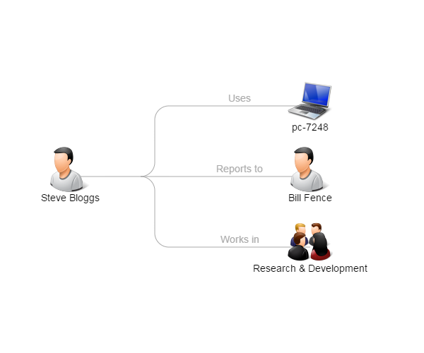

Canvas
======

A little javascript project to draw entity relationships on a HTML5 canvas.

It draws a little diagram showing how entities are related, and supports dragging
the final diagram around the canvas.

Entities have an icon and a caption.

Relationships have a line path, and an optional caption.

Example:

